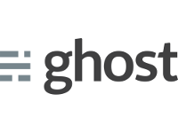
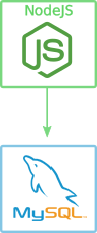
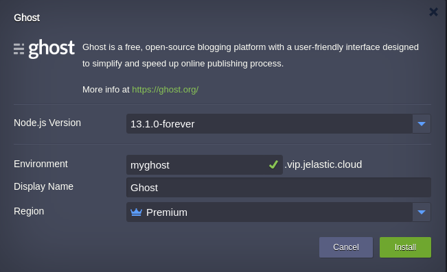
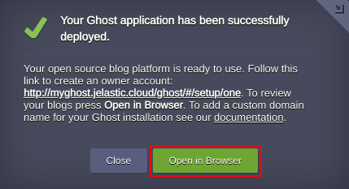

 

# Ghost is a professional publishing platform

### Highlights

This package is intended for bloggers to simplify Ghost publishing platform installation in order to create their own blogs from scratch in a couple of minutes.

### Environment Topology

 
 

 
### Deployment

In order to get this solution instantly deployed, click the **DEPLOY TO JELASTIC** button, specify your email address within the widget, choose one of the [Jelastic Public Cloud providers](https://jelastic.cloud/) and press Install.

 

If you are already registered at Jelastic, you can deploy *Ghost* by importing the required manifest using the link from GitHub:
[https://github.com/jelastic-jps/ghost/blob/master/manifest.jps](https://github.com/jelastic-jps/ghost/blob/master/manifest.jps)

 

In the installation wizard, if required, change settings such as *Environment Name* or *Region*. Then press __Install__ .

Now you can just click on the **Open in Browser** button within the shown frame and start using your blogging platform.

 

See more details in our [post](https://jelastic.com/blog/ghost-blogging-platform-automatic-installation-on-jelastic-paas/) how to create an owner account for your upcoming blogs.

Congratulations! You are ready to create your awesome blogs collaborating with your teammates.